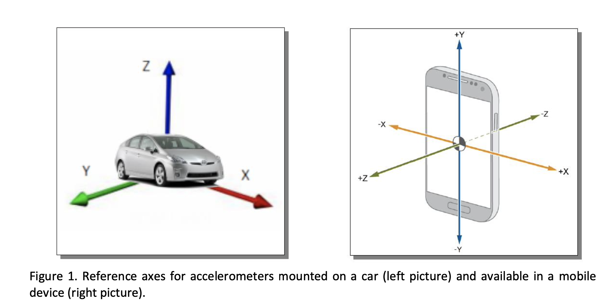

# accelerometer-transformation
Build the rotation matrix to the accelerometer signals to transform smartphone's orientation relative to the car

# Problem Definition
Accelerometers are devices measuring proper accelerations, i.e. acceleration of a body in its own instantaneous rest frame (the coordinate system – frame of reference – in which the body is at rest).
When mounted on a car, such sensors are obviously directed towards the car motion (velocity vector),according to the reference axis shown in the left picture of Figure 1. Vice versa, having to rely on anexternal device, such as a mobile phone, we have no guarantee about accelerometer orientation.Figure 1. Reference axes for accelerometers mounted on a car (left picture) and available in a mobiledevice (right picture).
Suppose now that the smartphone is well fixed in the car in an unknown position; if the mobile reference frame is the one depicted in the right part of Figure 1, how we could efficiently and reliably transform the collected signals so as to match the reference frame on the left.

# Solutions
* Utilize the GPS coordinates and speed data along with the accelerometer signals. The GPS data can provide information about the car's motion and orientation.
* Assuming the smartphone is fixed in the car, we can use the initial few seconds of data to determine the smartphone's orientation relative to the car. During this initial period, we expect the car to be stationary or moving in a straight line at a constant speed.
* Calculate the average acceleration values along each axis (x, y, z) of the smartphone during the initial period. If the car is stationary, the acceleration should only be due to gravity (g ≈ 9.8 $m/s^2$). If the car is moving at a constant speed, the acceleration in the direction of motion should be close to zero.
* Based on the average acceleration values, determine the orientation of the smartphone relative to the car. For example, if the average acceleration along the smartphone's y-axis is close to -9.8 $m/s^2$, it suggests that the smartphone's y-axis is aligned with the car's vertical axis (z-axis).
* Once the orientation is determined, create a rotation matrix to transform the smartphone's accelerometer signals to match the car's frame of reference. The rotation matrix will depend on the specific orientation of the smartphone.
* Apply the rotation matrix to the accelerometer signals for the entire dataset to obtain the transformed signals aligned with the car's frame of reference.

The transformed signals (in a new coordination) can be visualized:

# Further Improvement
To make the strategy more robust and accurate, we can leverage additional sensors available in a standard smartphone:

* Gyroscope: The gyroscope measures angular velocity and can help determine the smartphone's orientation changes over time. By integrating the gyroscope data, we can track the smartphone's rotation relative to its initial orientation.
* Magnetometer (compass): The magnetometer provides information about the smartphone's orientation relative to the Earth's magnetic field. It can help determine the initial heading of the car and assist in aligning the smartphone's frame of reference with the car's frame of reference.

By combining the accelerometer, gyroscope, and magnetometer data, we can develop a more robust strategy to estimate the smartphone's orientation and transform the signals accurately.
